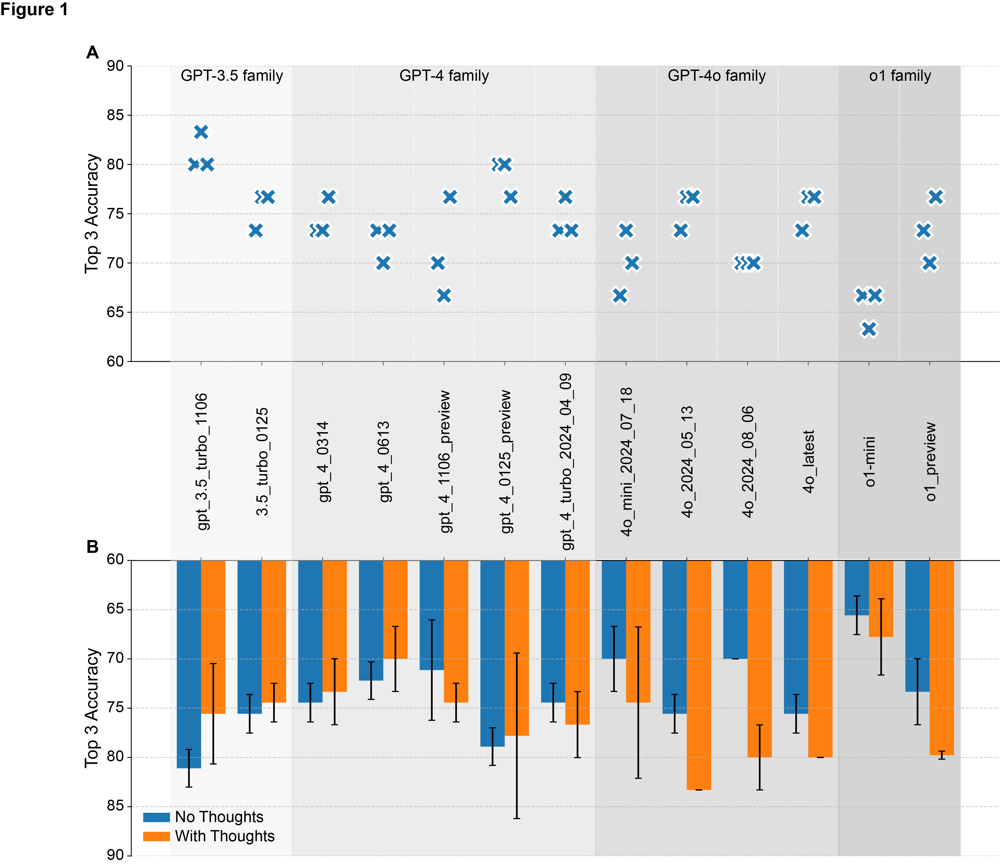

# GPT-Emergency-Department-Diagnosis-Evaluation(GPT_ED_DDX)
[](LICENSE)

## Overview
The **GPT-Emergency-Department-Diagnosis-Evaluation(GPT_ED_DDX)** is a research project aimed at evaluating the performance of various AI models in generating accurate differential diagnoses (DDX) for hypothetical emergency room cases. The project uses real-world-inspired scenarios to analyze the effectiveness of models in producing top 1 and top 3 DDX predictions. These predictions are visualized for detailed comparative analysis across different AI model versions.

## Key Features
- **Prompt Generation**: Generates and manages prompts tailored to evaluate AI models.
- **Model Performance Evaluation**: Evaluates top 1 and top 3 accuracy of AI models with varying configurations.
- **Configuration Flexibility**: Supports experiments with different prompt settings, including optional inclusion of clinical thoughts and lab results.

## Project Structure
```
ER_PROJECT/
├── Fig/                      # Generated figures and plots
├── generated_prompts_text/   # Generated prompt texts
├── result_gpt_.../           # Model-specific results
├── ER_gpt_o1.py              # Python scripts for calling o1 models
├── ER_gpt.py                 # Python scripts for calling other GPT models
├── ER_gpt_POT.py             # Python scripts for attempting  panel of thought
├── 30_cases_v0.3.xlsx        # Input data: patient cases, symptoms, and lab results
└── the_three.xlsx            # Data for ablation test
```

## Prerequisites
- **Python 3.8+**
- **Required Libraries**:
  - `pandas`
  - `matplotlib`
  - `openai`
  - `argparse`
  - `numpy`
  - `dotenv`

## Setup Instructions
1. Clone the repository:
   ```bash
    git clone https://github.com/JingeW/GPT-Emergency-Department-Diagnosis-Evaluation.git
    cd GPT-Emergency-Department-Diagnosis-Evaluation
   ```

2. Install required Python libraries:
   ```bash
   pip install -r requirements.txt
   ```

3. Ensure API keys for OpenAI are configured in the scripts or your environment.

## Scripts Description

### 1. Scripts in `scripts/`
- **Purpose**: Manage experiments with AI models for generating differential diagnoses and visualizing results.
- **Key Scripts**:
  - `ER_gpt.py`: Experiments with OpenAI GPT models.
  - `ER_gpt_o1.py`: Experiments with OpenAI o1 model.
  - `ER_gpt_POT.py`: Simulates physician-like discussions.
  - `prompt_generation.py`: Generate prompts for experiments.

### 2. Data Files
- **30_cases_v0.3.xlsx**: Main input data.
- **the_three.xlsx**: Data for ablation test.

## How to Run

### [Optional] Generate Prompts for webUI (eg. ChatGPT)
```bash
python scripts/prompt_generation.py
```

### Run Model Experiments
```bash
python scripts/ER_gpt.py --model <model_name> --rep 1 --with_thoughts --with_lr
```
Options:
- `--model`: AI model to test (e.g., `gpt-4-0613`, `o1-preview`).
- `--rep`: Repetition number for API calls.
- `--with_thoughts`: Include physician-like reasoning.
- `--with_lr`: Include lab results in the prompt.


## Results
- **Accuracy Analysis**: Outputs are stored in `result_gpt` directory.



## License
This project is for research purposes only. It should not be used for real medical diagnoses.

